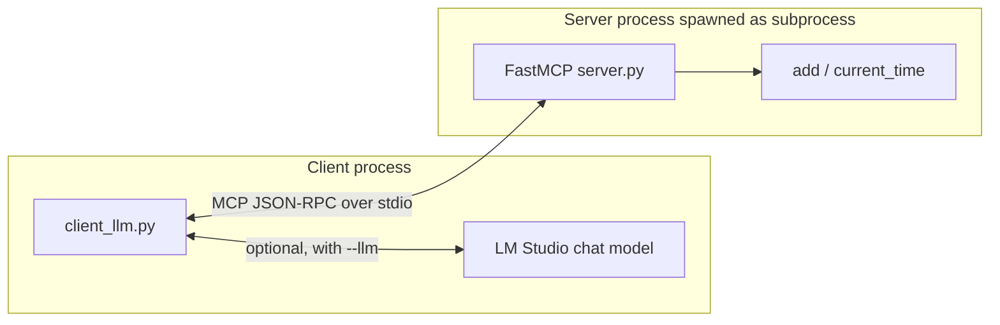

# mcp_demo — Model Context Protocol over stdio

A self-contained Python demo of the [Model Context Protocol](https://modelcontextprotocol.io/).
A local MCP server exposes two trivial tools (`add`, `current_time`) over
stdio, and a client connects to it either **without** an LLM (pure MCP
round-trip) or **with** an LM-Studio-served chat model doing agentic tool
calling.

No RAG, no database, no cross-demo imports — this folder is a standalone
[uv](https://docs.astral.sh/uv/) project.

## What this demo shows

- **MCP is a contract between processes.** The server can be any program
  in any language; the client speaks the same JSON-RPC protocol over
  stdio.
- **Tools live outside the LLM.** The server registers `add` and
  `current_time` without knowing anything about language models.
- **LLMs plug in on the client side.** The default path skips the LLM
  entirely. With `--llm`, the client advertises the MCP tools to an
  OpenAI-compatible chat model (served by LM Studio) using its standard
  `tools=[...]` parameter, runs whichever tool the model picks via MCP,
  and feeds the result back.



## Prerequisites

### 1. Install `uv`

```bash
brew install uv
# or see https://docs.astral.sh/uv/getting-started/installation/
```

### 2. (Only for `--llm`) Install and configure LM Studio

1. Install [LM Studio](https://lmstudio.ai/).
2. Download and load the chat model: `qwen/qwen3.5-9b`.
3. Start the local server from the **Developer** tab. Default endpoint is
   `http://127.0.0.1:1234/v1`.
4. Verify the server responds:

   ```bash
   curl http://127.0.0.1:1234/v1/models
   ```

> Pure MCP mode (no `--llm`) works **without** LM Studio — ideal as a stage
> backup if anything LLM-related misbehaves live.

## Setup

```bash
cd other-presentations/devtalks-roundtable/demo/mcp_demo
uv sync                  # installs openai + mcp[cli] + python-dotenv
cp .env.example .env     # only needed if you plan to use --llm
```

`uv sync` creates a `.venv` inside this folder; `uv run` handles activation
for you.

## Run

### Pure MCP (no LLM)

```bash
uv run client_llm.py
```

This:

1. Spawns `server.py` as a stdio subprocess via `uv run server.py`.
2. Calls `list_tools`, printing what the server advertises.
3. Calls `add(17, 25)` and `current_time("Asia/Jerusalem")` directly.

### MCP + LM Studio (agentic tool calling)

```bash
uv run client_llm.py --llm
uv run client_llm.py --llm -q "What is 42 times 0 plus 7, and what time is it in UTC?"
```

This runs the pure-MCP path first (to prove the server is healthy), then
opens a tool-calling loop: the LLM sees the MCP tool schemas, issues
`tool_calls`, the client executes each via MCP, and the model produces a
natural-language answer.

## How it works

### Server — [`server.py`](server.py)

- Built on `FastMCP` from the official `mcp` SDK.
- `@mcp.tool()` decorates two plain Python functions; FastMCP derives a
  JSON schema for each from the type hints and docstring.
- `mcp.run(transport="stdio")` at the bottom starts the JSON-RPC loop on
  stdin/stdout so any MCP client can spawn this file.

### Client — [`client_llm.py`](client_llm.py)

- `_server_params()` (line ~43) builds `StdioServerParameters` pointing at
  `uv run server.py`, which guarantees the subprocess uses this folder's
  virtual environment.
- `run_pure_mcp()` (line ~63) opens the stdio connection, `initialize`s
  the MCP session, lists tools, and calls them directly. This path never
  touches the LLM — useful as a sanity check or stage fallback.
- `_mcp_tools_to_openai_schema()` (line ~85) translates each MCP tool
  descriptor (name, description, `inputSchema`) into an entry for the
  OpenAI Chat Completions `tools=[...]` parameter.
- `run_llm_agent()` (line ~100) loops up to `max_steps` times: ask the
  chat model, execute any `tool_calls` via `session.call_tool`, append
  tool results as `role: "tool"` messages, stop when the model returns a
  plain message.

## Project layout

```text
mcp_demo/
├── README.md
├── pyproject.toml     # uv project definition
├── uv.lock
├── .python-version    # pins Python to 3.12
├── .env.example       # copy to .env for --llm mode
├── config.py          # env-backed Config dataclass
├── server.py          # FastMCP server exposing add + current_time
└── client_llm.py      # Pure-MCP and agentic-LLM client paths
```

## Configuration reference

| Variable          | Default                      | Used for    |
|-------------------|------------------------------|-------------|
| `OPENAI_BASE_URL` | `http://127.0.0.1:1234/v1`   | `--llm` path |
| `OPENAI_API_KEY`  | `lm-studio`                  | `--llm` path (placeholder) |
| `CHAT_MODEL`      | `qwen/qwen3.5-9b`            | `--llm` path |

The pure-MCP path reads none of the above.

## Troubleshooting

- **`FileNotFoundError: uv` when the client tries to spawn the server** —
  the client invokes `uv run server.py`. Install uv (`brew install uv`)
  and ensure it is on your PATH.
- **`Connection refused` in `--llm` mode** — LM Studio's local server is
  off, or `OPENAI_BASE_URL` points at the wrong host/port. Start the
  server in the Developer tab.
- **LLM never issues a tool call** — the loaded chat model does not
  support tool calling well. Try a different model in LM Studio, or just
  drop the `--llm` flag for the talk; the pure-MCP path already
  demonstrates MCP itself.
- **Stale server subprocess** — each `uv run client_llm.py` spawns a
  fresh server and tears it down when the `async with` block exits, so
  this should not happen; if it does, `pkill -f "uv run server.py"` is
  safe.

## Presentation tips

- Start with the pure-MCP path so the audience sees tools being listed
  and called *without* an LLM — this separates "MCP" from "LLM tool
  calling" in their heads.
- Then re-run with `--llm` on the same server: the narrative is "same
  tools, now the LLM decides when to call them."
- `current_time` is a great foil for the LLM because a model can only
  guess the real time; the `tool_call` proves the LLM reached out.

## References

- [Model Context Protocol spec](https://modelcontextprotocol.io/)
- [Official MCP Python SDK](https://github.com/modelcontextprotocol/python-sdk)
- [LM Studio tool-calling docs](https://lmstudio.ai/docs/advanced/tool-use)
- [OpenAI Chat Completions tool calling](https://platform.openai.com/docs/guides/function-calling)
- [uv docs](https://docs.astral.sh/uv/)
