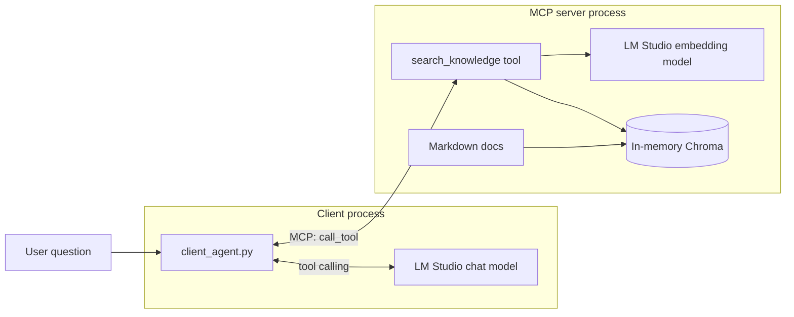

# mcp_rag_demo — RAG as an MCP tool

A self-contained Python demo that combines **MCP** and **RAG** into one
agentic workflow. An MCP stdio server owns an in-memory Chroma index of
the markdown files in [`documents/`](documents) and exposes
`search_knowledge(query, k)` as a tool. A client advertises that tool to
an LM-Studio-served chat model, which decides for itself when to retrieve
and then answers using the retrieved passages.

No shared code with [`../rag_demo`](../rag_demo) or
[`../mcp_demo`](../mcp_demo) — this folder is a standalone
[uv](https://docs.astral.sh/uv/) project.

## What this demo shows

- **RAG as a tool, not a pipeline.** The client does *not* hard-code a
  retrieve-then-generate flow; the LLM calls `search_knowledge` only when
  it decides it needs grounding, and can call it multiple times.
- **Clean process boundary.** The embedding model, Chroma client and
  document corpus all live inside the MCP server process. The client
  knows nothing about vectors.
- **Drop-in interoperability.** The same server can be plugged into any
  MCP-capable host (Claude Desktop, Cursor, a custom agent) without
  touching this client.



## Prerequisites

### 1. Install `uv`

```bash
brew install uv
# or see https://docs.astral.sh/uv/getting-started/installation/
```

### 2. Install and configure LM Studio

1. Install [LM Studio](https://lmstudio.ai/).
2. From the **Discover** tab, download both models:
   - Chat: `qwen/qwen3.5-9b`
   - Embeddings: `text-embedding-qwen3-embedding-4b`
3. Load both in the **Developer** tab and click **Start Server**. The
   default endpoint is `http://127.0.0.1:1234/v1`.
4. Verify:

   ```bash
   curl http://127.0.0.1:1234/v1/models
   ```

## Setup

```bash
cd other-presentations/devtalks-roundtable/demo/mcp_rag_demo
uv sync                  # installs openai + chromadb + mcp[cli] + python-dotenv
cp .env.example .env     # only if you need to override defaults
```

`uv sync` creates a `.venv` inside this folder automatically; `uv run`
activates it for each command.

## Run

### Agentic mode (default) — the LLM decides when to retrieve

```bash
uv run client_agent.py
uv run client_agent.py -q "Why combine MCP with RAG?"
```

Output shape:

```
Agentic MCP + RAG path
  chat model : qwen/qwen3.5-9b
  question   : ...
  MCP tools exposed to the LLM: ['search_knowledge', 'list_sources']

  Step 1: LLM asked for search_knowledge({'query': '...', 'k': 3})
    tool result (truncated) => [source: mcp_plus_rag.md] ...

  Final answer (after 1 tool call(s)):
    ...
```

### Fallback mode — always retrieve once, no tool calling

```bash
uv run client_agent.py --fallback
uv run client_agent.py --fallback -q "What is DevTalks and what is the official URL?"
```

Use this if your loaded chat model's tool-calling support is flaky during
the talk. The retrieval still goes through the MCP server, so you keep
the "RAG is an MCP tool" narrative; only the agentic decision is dropped.

## How it works

### Server — [`server.py`](server.py)

- Built on `FastMCP`; declares two tools:
  - `search_knowledge(query, k)` — runs a Chroma similarity search and
    returns the top-K passages, each prefixed with its source filename.
  - `list_sources()` — returns the filenames currently indexed.
- The Chroma collection is built **lazily** on the first tool call
  (`_ensure_index`, line ~53). This is important: `list_tools` still
  succeeds when LM Studio is not yet running, so you can demonstrate the
  MCP handshake before showing retrieval.
- All logging goes to stderr (`_log`, line ~36) so it never corrupts the
  stdio JSON-RPC stream.

### Client — [`client_agent.py`](client_agent.py)

- `_server_params()` (line ~47) spawns the server with `uv run server.py`
  so the subprocess uses this folder's `.venv`.
- `run_agentic()` (line ~77) is the main path:
  1. `session.initialize()` + `session.list_tools()`.
  2. `_mcp_tools_to_openai_schema()` (line ~62) rewrites each MCP tool
     descriptor as an OpenAI `tools=[...]` entry.
  3. In a loop, call `chat.completions.create(..., tools=...)`. If the
     assistant message contains `tool_calls`, execute each via
     `session.call_tool` and append a `role: "tool"` message with the
     result. Stop when the model produces a plain reply.
- `run_fallback()` (line ~148) short-circuits the loop: it always calls
  `search_knowledge` once via MCP, stuffs the retrieved passages into the
  prompt, and asks the LLM once — no tool calling required.

## Project layout

```text
mcp_rag_demo/
├── README.md
├── pyproject.toml
├── uv.lock
├── .python-version
├── .env.example
├── config.py            # env-backed Config dataclass
├── server.py            # FastMCP server: Chroma + search_knowledge tool
├── client_agent.py      # MCP client: agentic + fallback paths
└── documents/
    ├── mcp_overview.md
    ├── mcp_plus_rag.md
    ├── devtalks_conference.md   # DevTalks / devtalks.ro
    ├── qwen_models.md
    └── rag_overview.md
```

## Configuration reference

| Variable            | Default                             | Meaning                                    |
|---------------------|-------------------------------------|--------------------------------------------|
| `OPENAI_BASE_URL`   | `http://127.0.0.1:1234/v1`          | LM Studio endpoint (used by server + client) |
| `OPENAI_API_KEY`    | `lm-studio`                         | Placeholder                                |
| `CHAT_MODEL`        | `qwen/qwen3.5-9b`                   | Client-side chat model                     |
| `EMBEDDING_MODEL`   | `text-embedding-qwen3-embedding-4b` | Server-side embedding model                |
| `TOP_K`             | `3`                                 | Passages returned by `search_knowledge`    |

Both processes read the same `.env` because the server subprocess
inherits environment variables from the client.

## Troubleshooting

- **The LLM never calls `search_knowledge` and hallucinates an answer.**
  The loaded chat model does not support OpenAI-compatible tool calling
  well. Try a different model, or run with `--fallback` for a guaranteed
  RAG path.
- **The LLM loops calling the same tool.** Hit Ctrl+C. The client caps
  the loop at 5 steps (`max_steps` in `run_agentic`); lower it if the
  demo environment is chatty.
- **`Connection refused` on first tool call** — LM Studio server is off
  or the embedding model is not loaded. `list_tools` still works because
  the server defers embedding until the first tool call.
- **`FileNotFoundError: uv`** — the client invokes `uv run server.py`;
  install uv and make sure it is on your PATH.
- **Chroma shows a warning about telemetry or Python 3.13** — this
  project pins Python to 3.12 via `.python-version`; `uv sync` will
  install a matching interpreter automatically.

## Presentation tips

- Run [`../mcp_demo`](../mcp_demo) first (or at least mention it) so the
  audience already knows what "MCP" and "tool" mean.
- In the agentic run, point at the `Step 1: LLM asked for
  search_knowledge(...)` line — that is the moment the model decides to
  retrieve, which is the whole point of the demo.
- Have `--fallback` ready as a safety net; it keeps the story intact
  even if tool calling misfires live.

## References

- [Model Context Protocol spec](https://modelcontextprotocol.io/)
- [Official MCP Python SDK](https://github.com/modelcontextprotocol/python-sdk)
- [ChromaDB Python client](https://docs.trychroma.com/reference/python/client)
- [OpenAI Chat Completions tool calling](https://platform.openai.com/docs/guides/function-calling)
- [LM Studio docs](https://lmstudio.ai/docs)
- [uv docs](https://docs.astral.sh/uv/)
