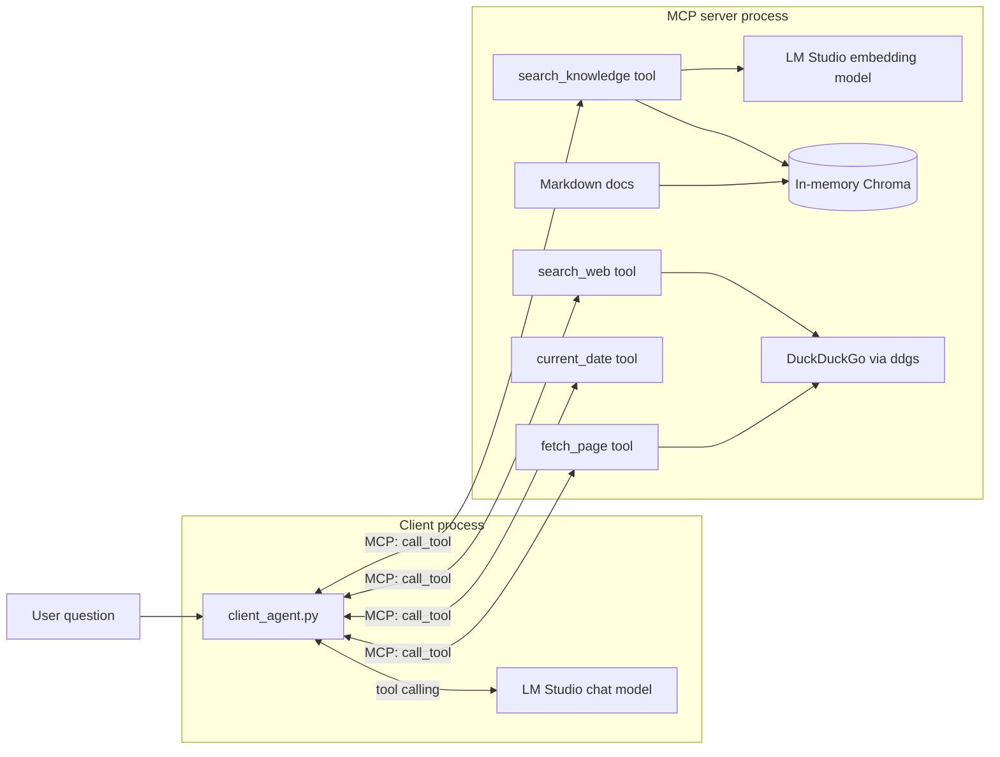

# mcp_rag_demo_web_search — RAG + live web search as MCP tools

A self-contained Python demo that combines **MCP** and **RAG** into one
agentic workflow, with **live web search**, a **page reader**, and a small
**current date** tool. An MCP stdio server owns an in-memory Chroma index
of the markdown files in [`documents/`](documents) and exposes
`search_knowledge(query, k)` for the local knowledge base,
`search_web(query, k)` for live DuckDuckGo results,
`fetch_page(url)` to read the full content of a result, and
`current_date(timezone)` so the model can ground relative dates. A client
advertises these tools to an LM-Studio-served chat model, which decides
for itself when to retrieve locally, search the web, open a page, or check
the date — then answers using the retrieved material.

This folder is a copy of [`../mcp_rag_demo`](../mcp_rag_demo) with the web
search, page-reading, and current-date tools added. It remains a
standalone [uv](https://docs.astral.sh/uv/) project with no shared code.

## What this demo shows

- **Search, then read.** `search_web` returns only snippets; when those
  are not enough the model calls `fetch_page(url)` to open a promising
  result and answer from its full content — the same loop a human uses.
- **Multiple tools, one decision-maker.** The LLM chooses between
  `search_knowledge` (local, grounded), `search_web` (live, current),
  `fetch_page` (read a URL), and `current_date` (grounds "today"/"this
  year") depending on the question — no hard-coded pipeline.
- **RAG as a tool, not a pipeline.** The client does *not* hard-code a
  retrieve-then-generate flow; the LLM calls a tool only when it decides
  it needs grounding, and can call either tool multiple times.
- **Clean process boundary.** The embedding model, Chroma client,
  document corpus, and web search client all live inside the MCP server
  process. The client knows nothing about vectors or HTTP.
- **Drop-in interoperability.** The same server can be plugged into any
  MCP-capable host (Claude Desktop, Cursor, a custom agent) without
  touching this client.



## Prerequisites

### 1. Install `uv`

```bash
brew install uv
# or see https://docs.astral.sh/uv/getting-started/installation/
```

### 2. Install and configure LM Studio

1. Install [LM Studio](https://lmstudio.ai/).
2. From the **Discover** tab, download both models:
   - Chat: `qwen/qwen3.5-9b`
   - Embeddings: `text-embedding-qwen3-embedding-4b`
3. Load both in the **Developer** tab and click **Start Server**. The
   default endpoint is `http://127.0.0.1:1234/v1`.
4. Verify:

   ```bash
   curl http://127.0.0.1:1234/v1/models
   ```

> `search_web` makes outbound HTTPS calls to DuckDuckGo, so this demo
> needs internet access at runtime.

## Setup

```bash
cd other-presentations/devtalks-roundtable/demo/mcp_rag_demo_web_search
uv sync                  # installs openai + chromadb + ddgs + mcp[cli] + python-dotenv
cp .env.example .env     # only if you need to override defaults
```

`uv sync` creates a `.venv` inside this folder automatically; `uv run`
activates it for each command.

## Run

### Agentic mode (default) — the LLM decides when and where to retrieve

```bash
uv run client_agent.py
uv run client_agent.py -q "Why combine MCP with RAG?"
uv run client_agent.py -q "What are the latest announcements from DevTalks this year?"
```

Output shape:

```
Agentic MCP + RAG path
  chat model : qwen/qwen3.5-9b
  question   : ...
  MCP tools exposed to the LLM: ['search_knowledge', 'search_web', 'fetch_page', 'current_date', 'list_sources']

  Step 1: LLM asked for search_web({'query': '...', 'k': 5})
    tool result (truncated) => 1. DevTalks Romania ...

  Step 2: LLM asked for fetch_page({'url': 'https://www.devtalks.ro/...'})
    tool result (truncated) => Content of https://www.devtalks.ro/... ...

  Final answer (after 2 tool call(s)):
    ...
```

### Fallback mode — always retrieve once from the knowledge base, no tool calling

```bash
uv run client_agent.py --fallback
uv run client_agent.py --fallback -q "What is DevTalks and what is the official URL?"
```

Use this if your loaded chat model's tool-calling support is flaky during
the talk. The local retrieval still goes through the MCP server, so you
keep the "RAG is an MCP tool" narrative; only the agentic decision (and
the web search tool) are dropped.

## How it works

### Server — [`server.py`](server.py)

- Built on `FastMCP`; declares these tools:
  - `search_knowledge(query, k)` — runs a Chroma similarity search and
    returns the top-K passages, each prefixed with its source filename.
  - `search_web(query, k)` — runs a live DuckDuckGo search via the
    [`ddgs`](https://pypi.org/project/ddgs/) metasearch library and
    returns the top-K result snippets, each numbered with its title, URL,
    and a short body.
  - `fetch_page(url, max_chars)` — fetches a URL (via `ddgs`'s `extract`)
    and returns its readable content as Markdown, truncated to `max_chars`
    (default 6000). This is what lets the model read past a snippet into
    the actual page — e.g. a speaker lineup or agenda — instead of giving
    up when the snippet is thin.
  - `current_date(timezone)` — returns today's date (default UTC) so the
    model can ground questions about "today", "now", or "this year"
    before searching. Needs neither LM Studio nor internet.
  - `list_sources()` — returns the filenames currently indexed.
- The Chroma collection is built **lazily** on the first tool call
  (`_ensure_index`). This is important: `list_tools` still succeeds when
  LM Studio is not yet running, so you can demonstrate the MCP handshake
  before showing retrieval. `search_web` does not require LM Studio or the
  index at all.
- All logging goes to stderr (`_log`) so it never corrupts the stdio
  JSON-RPC stream.

### Client — [`client_agent.py`](client_agent.py)

- `_server_params()` spawns the server with `uv run server.py` so the
  subprocess uses this folder's `.venv`.
- `run_agentic()` is the main path:
  1. `session.initialize()` + `session.list_tools()`.
  2. `_mcp_tools_to_openai_schema()` rewrites each MCP tool descriptor as
     an OpenAI `tools=[...]` entry.
  3. In a loop, call `chat.completions.create(..., tools=...)`. If the
     assistant message contains `tool_calls`, execute each via
     `session.call_tool` and append a `role: "tool"` message with the
     result. Stop when the model produces a plain reply.
  4. The system prompt steers the model to use `search_knowledge` for
     topics in the corpus, `search_web` for current information,
     `fetch_page` to read a promising result in full, and `current_date`
     to resolve relative dates. The loop cap is `max_steps=6` so a
     search → fetch → answer chain has room to complete.
- `run_fallback()` short-circuits the loop: it always calls
  `search_knowledge` once via MCP, stuffs the retrieved passages into the
  prompt, and asks the LLM once — no tool calling required.

## Project layout

```text
mcp_rag_demo_web_search/
├── README.md
├── pyproject.toml
├── uv.lock
├── .python-version
├── .env.example
├── config.py            # env-backed Config dataclass
├── server.py            # FastMCP server: Chroma + search_knowledge + search_web + fetch_page + current_date
├── client_agent.py      # MCP client: agentic + fallback paths
└── documents/
    ├── mcp_overview.md
    ├── mcp_plus_rag.md
    ├── devtalks_conference.md   # DevTalks / devtalks.ro
    ├── qwen_models.md
    └── rag_overview.md
```

## Configuration reference

| Variable            | Default                             | Meaning                                    |
|---------------------|-------------------------------------|--------------------------------------------|
| `OPENAI_BASE_URL`   | `http://127.0.0.1:1234/v1`          | LM Studio endpoint (used by server + client) |
| `OPENAI_API_KEY`    | `lm-studio`                         | Placeholder                                |
| `CHAT_MODEL`        | `qwen/qwen3.5-9b`                   | Client-side chat model                     |
| `EMBEDDING_MODEL`   | `text-embedding-qwen3-embedding-4b` | Server-side embedding model                |
| `TOP_K`             | `3`                                 | Passages returned by `search_knowledge`    |

Both processes read the same `.env` because the server subprocess
inherits environment variables from the client. `search_web` reads none
of the above — it talks directly to DuckDuckGo.

## Troubleshooting

- **The LLM never calls a tool and hallucinates an answer.** The loaded
  chat model does not support OpenAI-compatible tool calling well. Try a
  different model, or run with `--fallback` for a guaranteed RAG path.
- **The LLM loops calling the same tool.** Hit Ctrl+C. The client caps
  the loop at 5 steps (`max_steps` in `run_agentic`); lower it if the
  demo environment is chatty.
- **`search_web` returns "Web search failed: ...".** DuckDuckGo may be
  rate-limiting or the machine is offline. The tool surfaces the error to
  the LLM rather than crashing; retry, or lean on `search_knowledge`.
- **`Connection refused` on a `search_knowledge` call** — LM Studio
  server is off or the embedding model is not loaded. `list_tools` still
  works because the server defers embedding until the first tool call.
- **`FileNotFoundError: uv`** — the client invokes `uv run server.py`;
  install uv and make sure it is on your PATH.
- **Chroma shows a warning about telemetry or Python 3.13** — this
  project pins Python to 3.12 via `.python-version`; `uv sync` will
  install a matching interpreter automatically.

## Presentation tips

- Run [`../mcp_rag_demo`](../mcp_rag_demo) first to establish the
  "RAG is an MCP tool" story, then introduce this variant: "same server,
  now with a second tool — and the model picks which one to use."
- Ask a knowledge-base question and a current-events question
  back-to-back so the audience sees the model route to `search_knowledge`
  vs `search_web` on its own.
- Have `--fallback` ready as a safety net; it keeps the local RAG story
  intact even if tool calling misfires live.

## References

- [Model Context Protocol spec](https://modelcontextprotocol.io/)
- [Official MCP Python SDK](https://github.com/modelcontextprotocol/python-sdk)
- [ChromaDB Python client](https://docs.trychroma.com/reference/python/client)
- [ddgs metasearch library](https://pypi.org/project/ddgs/)
- [OpenAI Chat Completions tool calling](https://platform.openai.com/docs/guides/function-calling)
- [LM Studio docs](https://lmstudio.ai/docs)
- [uv docs](https://docs.astral.sh/uv/)
