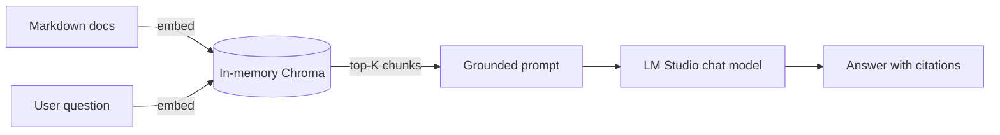

# rag_demo — In-memory Retrieval-Augmented Generation

A self-contained, presenter-friendly Python demo of a minimal RAG pipeline.
Markdown files in [`documents/`](documents) are ingested into an **in-memory
ChromaDB** collection, embedded with an LM-Studio-served embedding model, and
used as grounding context for an LM-Studio-served chat model.

No MCP, no persistence, no cross-demo imports — this folder is a standalone
[uv](https://docs.astral.sh/uv/) project.

## What this demo shows

Three classic RAG stages happen in front of the audience, in order:

1. **Ingestion** — read all `.md` files and store them, together with
   dense embeddings, in a fresh in-memory Chroma collection.
2. **Retrieval** — embed the user's question with the *same* embedding
   model and pull the top-K nearest chunks.
3. **Generation** — stitch the retrieved chunks into a grounded prompt and
   ask the chat model to answer using only that context.



## Prerequisites

### 1. Install `uv`

```bash
brew install uv
# or see https://docs.astral.sh/uv/getting-started/installation/
```

### 2. Install and configure LM Studio

1. Install [LM Studio](https://lmstudio.ai/).
2. From the **Discover** tab, download both models:
   - Chat: `qwen/qwen3.5-9b`
   - Embeddings: `text-embedding-qwen3-embedding-4b`
3. Open the **Developer** tab, load both models, and **Start Server**. The
   default endpoint is `http://127.0.0.1:1234/v1`.
4. Verify the server responds:

   ```bash
   curl http://127.0.0.1:1234/v1/models
   ```

## Setup

```bash
cd other-presentations/devtalks-roundtable/demo/rag_demo
uv sync                  # resolve + install deps from pyproject.toml / uv.lock
cp .env.example .env     # adjust only if your LM Studio host / port / model IDs differ
```

`uv sync` automatically creates a `.venv` inside this folder — you do **not**
need to activate it manually; `uv run` handles that for you.

## Run

One-shot, with the default canned question:

```bash
uv run ingest_and_chat.py
```

Ask your own question:

```bash
uv run ingest_and_chat.py --question "What is DevTalks and where is the official site?"
```

Interactive REPL (good for live Q&A on stage):

```bash
uv run ingest_and_chat.py --interactive
```

Expected output shape:

```
RAG demo configuration:
  base URL         : http://127.0.0.1:1234/v1
  chat model       : qwen/qwen3.5-9b
  embedding model  : text-embedding-qwen3-embedding-4b
  top-K            : 3

Ingesting documents from ./documents ...
  indexed 4 documents into collection 'devtalks_rag_demo'.

> Question: ...
  Retrieved top-3 passages:
   1. qwen_models.md  (distance=0.2831)  ...
   2. rag_overview.md (distance=0.3914)  ...
   3. lm_studio.md    (distance=0.4102)  ...

  Answer:
   ...
```

## How it works

All logic lives in a single file: [`ingest_and_chat.py`](ingest_and_chat.py).

- `OpenAIEmbeddingFunction` (around line 26) is a Chroma-compatible
  embedding function that forwards batches of strings to
  `client.embeddings.create`. This keeps a single code path: the same
  `openai` SDK instance is used for embeddings *and* chat, with only the
  `base_url` changed.
- `load_markdown_files` (line 46) reads every `.md` file under
  [`documents/`](documents) as one chunk. For a bigger corpus you'd split
  long files, but for a ~3 minute demo one chunk per file keeps the story
  simple.
- `build_collection` (line 54) calls `chromadb.EphemeralClient()` (in
  `main`, line 147) to create a process-lifetime-only store, then
  `collection.add(ids, documents, metadatas)` which internally uses the
  embedding function above to vectorize each document.
- `retrieve` (line 72) runs `collection.query(query_texts=...)` — Chroma
  embeds the question with the same function and returns the nearest
  neighbours with distances.
- `build_prompt` (line 84) concatenates the hits as a `Context:` block and
  wraps them with a strict system prompt that forbids using outside
  knowledge and requires citing sources.
- `answer` (line 98) calls `chat.completions.create` on the chat model and
  prints both the retrieved passages (so the audience can sanity-check the
  retrieval) and the final grounded answer.

## Project layout

```text
rag_demo/
├── README.md
├── pyproject.toml         # uv project definition
├── uv.lock                # pinned dependency graph
├── .python-version        # pins Python to 3.12
├── .env.example           # copy to .env
├── config.py              # env-backed Config dataclass
├── ingest_and_chat.py     # single-file RAG pipeline entrypoint
└── documents/
    ├── lm_studio.md
    ├── devtalks_conference.md   # DevTalks / devtalks.ro
    ├── qwen_models.md
    └── rag_overview.md
```

## Configuration reference

| Variable            | Default                          | Meaning                                    |
|---------------------|----------------------------------|--------------------------------------------|
| `OPENAI_BASE_URL`   | `http://127.0.0.1:1234/v1`       | LM Studio OpenAI-compatible endpoint       |
| `OPENAI_API_KEY`    | `lm-studio`                      | Placeholder; LM Studio does not validate   |
| `CHAT_MODEL`        | `qwen/qwen3.5-9b`                | Model ID used for generation               |
| `EMBEDDING_MODEL`   | `text-embedding-qwen3-embedding-4b` | Model ID used for embeddings            |
| `TOP_K`             | `3`                              | Number of passages retrieved per question  |

## Troubleshooting

- **`Connection refused` / `APIConnectionError`** — LM Studio's local
  server is not running, or `OPENAI_BASE_URL` points to the wrong
  host/port. Fix by starting the server in LM Studio's Developer tab and
  confirming with `curl http://127.0.0.1:1234/v1/models`.
- **`model ... not found`** — the model ID in `.env` does not exactly
  match a loaded model in LM Studio. Copy the identifier from LM Studio's
  **My Models** list verbatim, including the `qwen/` prefix.
- **Embeddings return an unexpected dimension / HTTP 500** — an embedding
  model is not loaded in LM Studio, or the loaded one is a chat model.
  Verify that both a chat and an embedding model are loaded.
- **`ImportError` about `chromadb` on Python 3.13+** — this project pins
  Python to 3.12 via `.python-version` and `uv sync` will install a
  compatible interpreter automatically.
- **`KeyError: 'documents'` from Chroma query** — means the collection is
  empty; re-run the script (it rebuilds the collection each time).

## Presentation tips

- Before you start talking, run once silently so LM Studio JIT-loads the
  models and the first latency spike is out of the way.
- Narrate the three stages (ingest / retrieve / generate) while the script
  prints them — the output is designed to match the story.
- Use `--interactive` for audience Q&A; use a single `--question` for a
  rehearsed demo flow.

## References

- [ChromaDB Python client](https://docs.trychroma.com/reference/python/client) — `EphemeralClient`, collections
- [OpenAI Python SDK](https://github.com/openai/openai-python) — `base_url` override
- [LM Studio local server](https://lmstudio.ai/docs/local-server) — OpenAI-compatible endpoint
- [uv docs](https://docs.astral.sh/uv/) — `uv sync`, `uv run`
